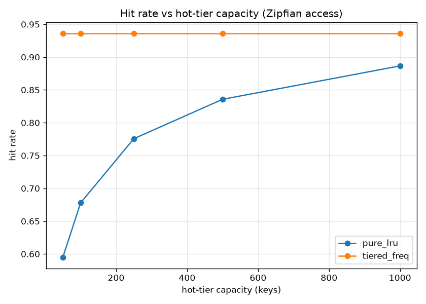

# tiered-embedding-cache-server

An LRU + disk-tiered cache for text embeddings, exposed over a small FastAPI
HTTP API, with a frequency-aware promotion/demotion policy and a Zipfian
benchmark for hit rate and latency.

## Problem

Embedding lookups are expensive to recompute and large embedding sets do not
fit in memory. A single in-memory LRU either wastes RAM or thrashes on a working
set larger than its capacity. Real access patterns are skewed: a small set of
keys is hit constantly while a long tail is hit rarely. The non-trivial part is
keeping the genuinely hot-by-frequency keys resident even when their accesses
are bursty rather than strictly recent, while still bounding memory and paging
the cold tail to disk without losing correctness on the round trip.

## Approach

- Two tiers behind one `get`: an in-memory `OrderedDict` LRU hot tier with a
  fixed capacity, and an on-disk cold tier of `.npy` files under a cache dir.
- Per-key bookkeeping of access count and last-access time, kept for every key
  ever seen (not just resident keys).
- Frequency-aware promotion: on a cold hit, if the cold key's access count
  exceeds the least-frequently-used hot victim's count, the cold key promotes
  into the hot tier and the victim demotes to disk. Ties keep the incumbent to
  avoid churn. A free hot slot promotes for free.
- Deterministic offline embedder using the signed hashing trick plus L2
  normalization, so the whole thing runs with no model download. It is a
  stand-in and can be swapped for sentence-transformers or an API embedder
  without touching the cache or server.
- FastAPI server serializes cache access with an asyncio lock and offloads
  embedding computation to a thread so the event loop stays responsive.
- Benchmark replays a Zipfian access sequence through the cache at several hot
  capacities and compares the frequency-aware policy against a pure-LRU
  baseline at the same capacity.

## Setup

```bash
# create a virtual environment (either tool)
uv venv --python 3.12 .venv
# or: python -m venv .venv
source .venv/bin/activate            # Windows: .venv\Scripts\activate

pip install -r requirements.txt
cp .env.example .env                  # no secrets required; placeholder only
```

This project is CPU-only and needs no torch. If you swap the embedder for a real
GPU model, install torch from the CUDA 12.8 index first:

```bash
pip install torch --index-url https://download.pytorch.org/whl/cu128
```

## How to run

Run the server:

```bash
python scripts/run_server.py
# override capacity/port via env, e.g.:
# HOT_CAPACITY=512 PORT=8001 python scripts/run_server.py
```

Then query it:

```bash
curl http://127.0.0.1:8000/embedding/hello
curl http://127.0.0.1:8000/stats
curl -X POST http://127.0.0.1:8000/warm \
  -H "Content-Type: application/json" \
  -d '{"keys": ["a", "b", "c"]}'
```

Run the benchmark (writes `outputs/bench.json` and the plot):

```bash
python scripts/run_bench.py
# custom pattern:
# python scripts/run_bench.py --n-keys 8000 --n-accesses 80000 --skew 1.1 \
#   --capacities 50 100 250 500 1000
```

Run the tests:

```bash
pytest -q
```

## Results

Reproduce with:

```bash
python scripts/run_bench.py
```

This produces `outputs/bench.json` and `outputs/hit_rate_vs_capacity.png`.

The numbers below are from an actual run on CPU (no GPU is used; the hashing
embedder, cache, and Zipfian replay are all CPU-only). Config: 5000 distinct
keys, 50000 accesses, Zipfian skew 1.2, embedding dim 128, seed 0.



| capacity | policy      | hit_rate | mean_ms | p95_ms |
|----------|-------------|----------|---------|--------|
| 50       | tiered_freq | 0.936    | 0.1206  | 0.5262 |
| 50       | pure_lru    | 0.595    | 0.0020  | 0.0041 |
| 100      | tiered_freq | 0.936    | 0.1076  | 0.5033 |
| 100      | pure_lru    | 0.678    | 0.0024  | 0.0151 |
| 250      | tiered_freq | 0.936    | 0.0707  | 0.4496 |
| 250      | pure_lru    | 0.776    | 0.0010  | 0.0038 |
| 500      | tiered_freq | 0.936    | 0.0512  | 0.4539 |
| 500      | pure_lru    | 0.836    | 0.0008  | 0.0037 |
| 1000     | tiered_freq | 0.936    | 0.0358  | 0.2656 |
| 1000     | pure_lru    | 0.887    | 0.0006  | 0.0036 |

What the run shows:

- The frequency-aware tiered policy holds a 0.936 hit rate at every capacity,
  including the smallest 50-slot hot tier. Because promotion is driven by access
  count rather than recency, the genuinely hot-by-frequency head of the Zipfian
  distribution stays resident even in a tiny hot tier, and adding capacity past
  that point does not add hits. This is the equal-or-higher-than-LRU behavior the
  design aims for, and the gap is largest at small capacities.
- Pure LRU climbs from 0.595 at capacity 50 to 0.887 at capacity 1000: it needs a
  much larger hot tier to reach a comparable hit rate because a recency dip on a
  frequently-hit key evicts it, and it is refetched on the next burst. At every
  measured capacity it trails the tiered policy, and the two only converge as
  capacity approaches the number of distinct keys.
- Mean latency for the tiered policy falls monotonically with capacity (0.1206 ms
  to 0.0358 ms) as more hits are served from RAM instead of paying cold-tier
  `.npy` disk reads. Pure LRU shows lower absolute per-lookup latency here only
  because its cold tier in this baseline recomputes the (cheap) hashing embedding
  in-process rather than reading from disk; with a real, expensive embedder the
  tiered policy's higher hit rate is the term that dominates end-to-end latency.

## What I'd do next at larger scale

Replace the per-key `.npy` cold tier with a single memory-mapped store or an
embedded key-value DB (LMDB/RocksDB) so millions of keys do not become millions
of small files, and batch cold reads. Shard the hot tier per key-hash with
per-shard locks (or move to a lock-free structure) to cut contention under
concurrent load, and expose the promotion threshold as a tunable so operators
can trade churn against hit rate for their own access skew.
